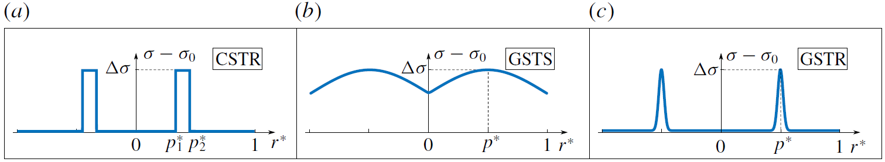
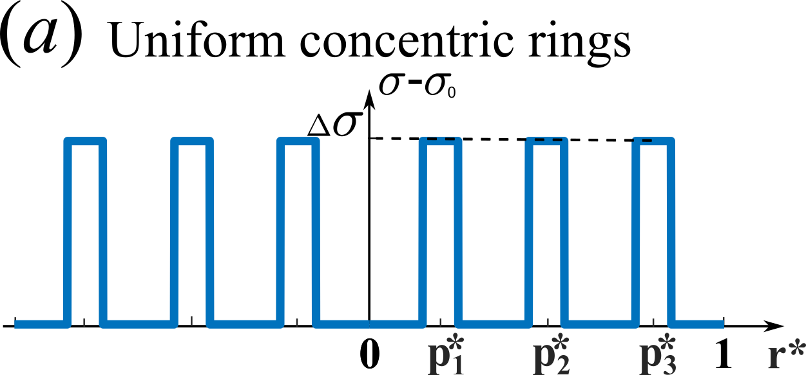
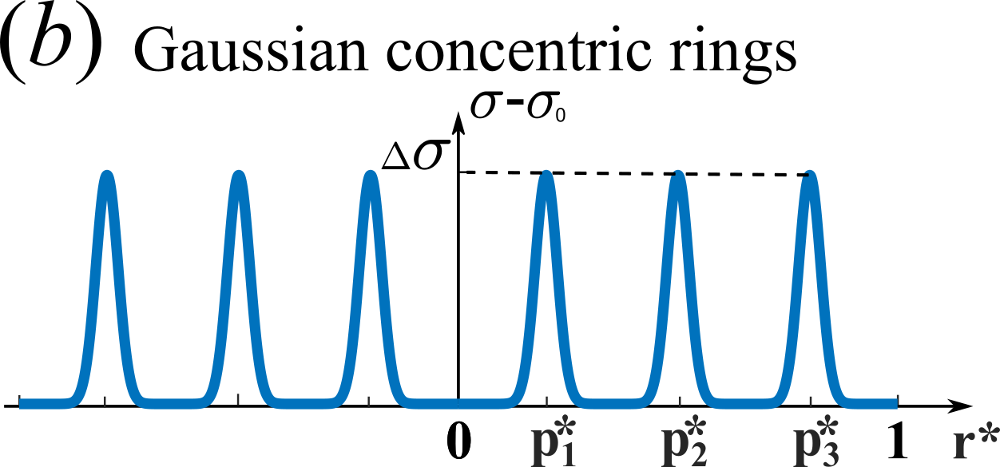

# Stream-Function-in-Spherical-Cap-by-Surface-Tension
This project is associated with the paper published in JFM: [Marangoni circulation by UV light modulation on sessile drop for particle agglomeration](https://doi.org/10.1017/jfm.2019.373).

This project is used to calculate the Marangoni flow stream function in a spherical cap droplet of various contact angle based on Stokes flow assumption. The codes are packed into 4 parts, **GaussianAndStep**, **Concentric**, **MultipleGaussian** and **Plot**. For **GaussianAndStep**, **Concentric** and **MultipleGaussian** folders, their difference are in file *N2.m*, which is is the function discribing different surface tension boundary conditions and the main code is *GaussianTensionStreamFunction.m* for all 3 folders. The **Plot** folder contains the codes used to plot the streamlines after finding the stream function field.
## GaussianAndStep
The codes in **GaussianAndStep** folder are used to find stream function field for a Gaussian surface tension distribution or a step function surface tension distribution as shown below.

## Concentric
The codes in **Concentric** folder are used to find stream function field for a concentric surface tension distribution as shown below.

## MultipleGaussian
The codes in **MultipleGuassian** folder are used to find stream function field for multiple Gaussian surface tension distribution as shown below.

## Plot
This folder contains 2 codes for ploting streamlines. *StreamFunctionPlot.m* create a draft plot for adjusting the contour value list and *StreamFunctionPlot_Final.m* plots the refined contour.
